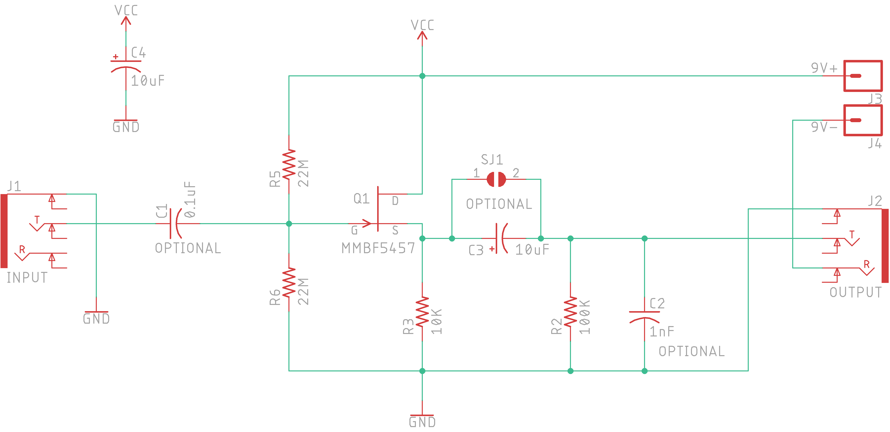

# micpreamp
A microphone preamp that works well with piezo disc contact mics

It's based on the schematic (and comments) at [this Instructable](https://www.instructables.com/id/Guitar-Contact-Microphone-Preamp/). I designed the board to be all SMD and to sit underneath the long-lead PC-mount 1/4" stereo jacks. A nice detail is that it turns off when you disconnect a cable from the output jack, so there's no on-off switch for the unit. 

I made these for a workshop that I did at the Haystack Mountain School of Crafts, for the 2018 MassArt Alumni Retreat. I soldered all the SMD components beforehand and participants soldered the jacks and the battery snaps. Then they made contact mics from piezo discs that I supplied. These preamps worked great to get better sound out of the contact mics. I've included the files that I used to laser cut little boxes from lauan plywood scraps I had lying around. They fit tightly into the laser cut boxes with a 9V battery. 

## Bill of Materials

| Qty | Ref | Supplier        | Part                      | Link  |
|:---:|:---:|--------------- | ------------------------- | ----- |
| 2   | J1,J2 | All Electronics | PC Mount 1/4" Stereo Jack |  [SPHJ-12](https://www.allelectronics.com/item/sphj-12/stereo-1/4-phone-jack-pc-mount/1.html) |
| 1   |       | All Electronics | 9V Battery Snap I-Type    |  [BST-51](https://www.allelectronics.com/item/bst-51/9v-battery-snap-i-type/1.html) 
| 2   |       | Full Compass    | Neutrik NRJ-NUT-B Neutrik NRJ Jack Hex Nut | [NRJ-NUT-B](https://www.fullcompass.com/prod/119396-neutrik-nrj-nut-b-neutrik-nrj-jack-hex-nut) |
| 2   | C3,C4 | Arrow | Cap Aluminum Lytic 10uF 16V 20%  | [UWX1C100MCL1GB](https://www.arrow.com/en/products/uwx1c100mcl1gb/nichicon) |
| 2   | R5,R6 | Arrow | Res Thick Film 0805 22M Ohm 5% 0.25W  | [RK73B2ATTD226J](https://www.arrow.com/en/products/rk73b2attd226j/koa-speer-electronics) |
| 1   | R3    | Arrow | Res Thick Film 0805 10K Ohm 1% 0.125W  | [CRG0805F10K/10](https://www.arrow.com/en/products/crg0805f10k10/te-connectivity) |
| 1   | C2    | Arrow | Cap Ceramic 0.001uF (1nF) 50V X7R 5% SMD 0805  | [CL21B102JBANNNC](https://www.arrow.com/en/products/cl21b102jbannnc/samsung-electro-mechanics) |
| 1   | C1    | Arrow | Cap Ceramic 0.1uF 25V X7R 10% SMD 0805  | [08053C104KAT4A](https://www.arrow.com/en/products/08053c104kat4a/avx) |
| 1   | Q1 | Arrow | Trans JFET N-CH 25V 3-Pin SOT-23 T/R  | [MMBF5457](https://www.arrow.com/en/products/mmbf5457/on-semiconductor) |
| 1   | R2 | Arrow | Res Thick Film 0805 100K Ohm 1% 0.125W  | [RMCF0805FG100K](https://www.arrow.com/en/products/rmcf0805fg100k/stackpole-electronics) |

The jacks seem like surplus from All Electronics and are pretty particular, so hopefully you can still get them as you read this. They didn't include the nuts, so I had to find those at from a different supplier. Check with me before you buy parts - I might have extra parts or even a fully assembled unit.

You could experiment with leaving out C1, C2, and/or C3, but I used them on the boards I made. If you left out C1, you'd have to jump its pads by making a solder bridge between them. The same goes for C3, but since the gap is larger for that capacitor, I left a solder-jumper on the board. You could play around with these variables or just include all the parts as I did, since they cost pennies.

## Assembly

You can order [the PCB from Oshpark](https://oshpark.com/shared_projects/s4lVvGy5) if you want. You'll get three boards for the price that they show. A couple notes about soldering the components to the board: First, everything is soldered on the *top* side of the board. Obviously the jacks go on last (since most of the other components are underneath the jacks). It's okay to solder the battery snap leads on after the jacks, though. Second: Even though I added thermals where the 10uF caps get soldered to the ground plane, it's difficult to get the heat right if you're soldering by hand. This might be a good project with which to hone your hot plate, toaster oven, hot air reflow, or other techniques, rather than soldering with an iron. 🤷🏽‍♂️

Have fun :)

